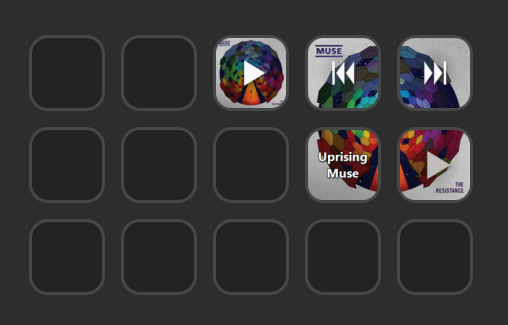
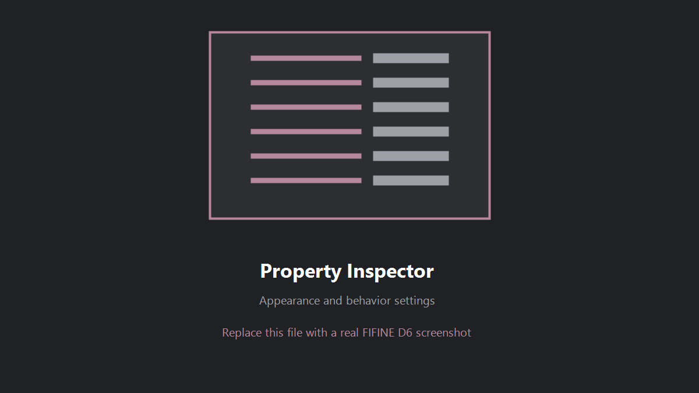
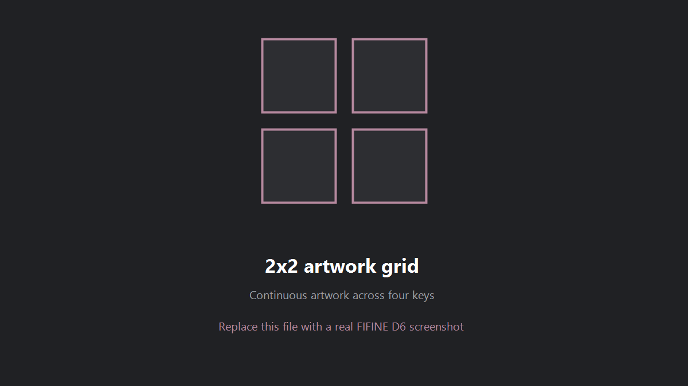

<p align="center">
  
</p>

# Visual Media Control

Artwork and media controls for the **FIFINE D6 Stream Controller Deck** on Windows.

It uses the media information Windows already receives from apps such as Spotify, YouTube in Chrome/Edge, VLC, and other players. No Spotify account, browser extension, or internet connection is required by the plugin.

> Built and tested on a FIFINE D6 with FIFINE Control Deck. Other StreamDock-compatible devices may work, but I have not tested them.

## Screenshots

| D6 layout | Settings |
| --- | --- |
|  |  |



These are placeholders for now. Real D6 screenshots are coming later.

## What it can do

- Show the current track, album, or video artwork on a key
- Play / Pause, Previous, and Next controls
- Optional 2x2 artwork grid with compensation for the physical gaps between D6 keys
- Title and artist text with font, gradient, alignment, shadow, outline, and auto-fit controls
- Custom PNG icons per key
- Configurable icon size, color/gradient, transparency, shadow, and backdrop

## Installation

### Manual install (recommended)

1. Download `Visual-Media-Control-v1.0.0-manual.zip` from [Releases](https://github.com/marehori/visual-media-control/releases/latest).
2. Close FIFINE Control Deck completely, including its tray icon.
3. Extract `com.marehori.nowplaying.sdPlugin` into:

```text
%APPDATA%\HotSpot\StreamDock\plugins\
```

The final path should be:

```text
%APPDATA%\HotSpot\StreamDock\plugins\com.marehori.nowplaying.sdPlugin\
```

Start FIFINE Control Deck again and find **Visual Media Control** in the action list.

### PowerShell installer

Download and extract `Visual-Media-Control-v1.0.0.zip`, close FIFINE Control Deck, then right-click `Install-For-FIFINE.ps1` and select **Run with PowerShell**.

If Windows blocks the script, open PowerShell in the extracted folder and run:

```powershell
powershell -ExecutionPolicy Bypass -File .\Install-For-FIFINE.ps1
```

The installer backs up an existing version before replacing it.

### About the EXE inside the plugin folder

`VisualMediaControl.exe` is not an installer and should not be opened manually. FIFINE Control Deck uses it as the plugin entry point. It only starts the included `plugin.ps1` with the arguments provided by Control Deck. Its complete source is in `source/Launcher.cs`, and `Build-Release.ps1` rebuilds it using the C# compiler included with Windows.

## 2x2 artwork grid

Place the four grid actions like this:

```text
Top Left       Top Right
Bottom Left    Bottom Right
```

Each key can be Artwork only, Play / Pause, Previous track, Next track, or Title. Change **Grid → Bezel gap** on any grid key to adjust how much artwork is hidden behind the physical frame. The setting is shared by all four grid keys.

## Notes

- Artwork and text come from Windows Global System Media Transport Controls.
- Some apps publish playback controls but no artwork. That is controlled by the media app, not the plugin.
- Custom icons look best as square 288×288 PNG files with a transparent background.
- Everything runs locally. The plugin does not contact an external server.

## Uninstall

Close FIFINE Control Deck and run:

```powershell
powershell -ExecutionPolicy Bypass -File .\Uninstall-From-FIFINE.ps1
```

## Development

The runtime is PowerShell 5.1 with a tiny C# launcher. `source/GenerateIcons.ps1` rebuilds the icon set, and `Build-Release.ps1` creates the full and manual-install release ZIPs.

Bug reports and D6 compatibility notes are welcome in [Issues](https://github.com/marehori/visual-media-control/issues).

MIT License. Made by [marehori](https://github.com/marehori).
